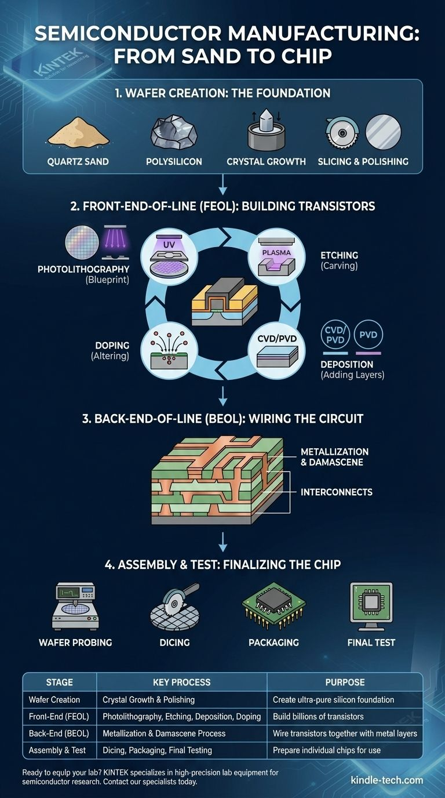

## Description

This display makes the journey from raw material to functional chip legible to someone with no engineering background — the "**from quartz to chip**" story. It combines wall graphics, diagrams, and possibly moving image with physical props (quartz, wafers, chips, boards, and other fabrication-related objects) laid out along a step-by-step visitor path: **material → design → fabrication → packaging → use**.

A visitor should walk away from this piece understanding, in outline, what actually has to happen for a rock to become a computer — and why that process, historically locked inside a handful of enormous companies, is one of the things [[dacc.concept.d-acc]] is trying to open up.

## Linked concepts

- [[dacc.concept.chip-fabrication]]
- [[dacc.concept.open-silicon]]
- [[dacc.concept.d-acc]]
- [[dacc.artefact.silicon-lab.wafer-die-chip-samples]] — the physical objects referenced in this display are the same class of object shown up close in the samples case.
- [[dacc.artefact.silicon-lab.openpdk-tooling]] — the "design" step in this display's path is where the open tooling exhibit picks up in more depth.

## Section

[[dacc.section.silicon-lab]]

## Curatorial notes

Open items pending from QZ/Vensa:

- confirmation of available physical samples (quartz, wafers, chips, boards, other fab-related objects);
- approved diagrams/images for wall graphics;
- whether a fabrication-process video exists and is clearable for use;
- dimensions, case, and plinth requirements for any physical props.

Nothing in this display should be treated as finalised until the above is confirmed — this is a design brief, not approved content.

## Ideas

- Consider whether the five path stages (material / design / fabrication / packaging / use) should each get a dedicated physical marker or case along the walk, rather than being conveyed only through wall graphics.
- If a fab-process video is available, it could anchor the whole display rather than compete with static graphics — worth deciding early since it affects space and AV requirements.
- Possible connection point: end the path at "use" with a nod toward [[dacc.artefact.silicon-lab.chip-examples-and-outputs]], so the story doesn't feel abstract.
