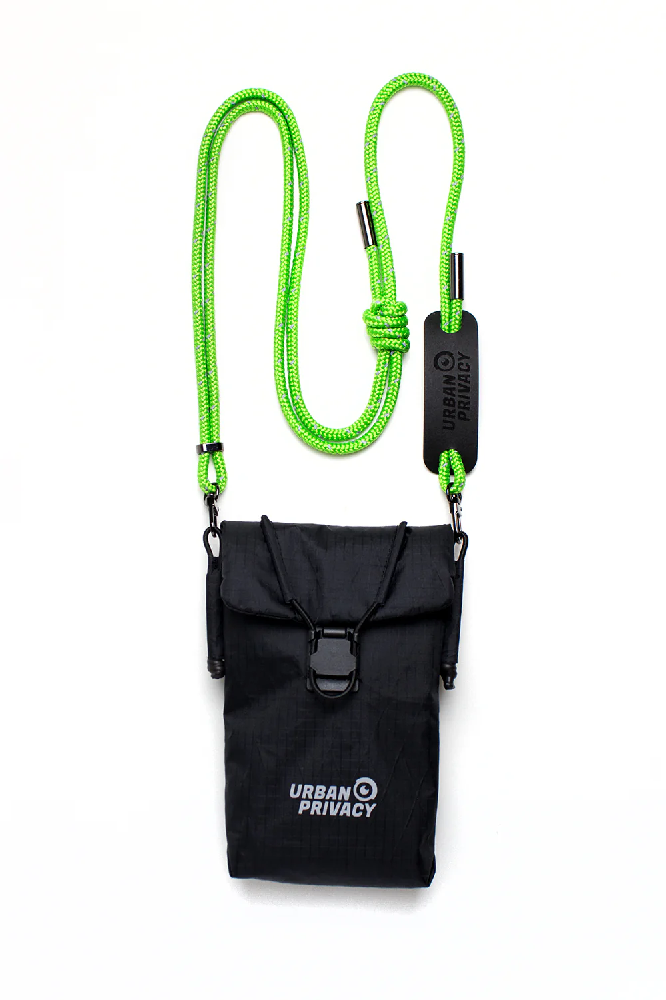

## Description

**OFLAIN V2** is a wearable Faraday smartphone bag that allows its owner to physically switch a smartphone between an online and an offline state. Rather than relying on software controls such as airplane mode, it uses conductive shielding materials (silver, copper, and nickel) to block cellular, GPS, Wi-Fi, Bluetooth, and RFID signals when the phone is placed inside its shielded compartment. A second, unshielded pocket allows the phone to remain connected when desired. The object is designed as an everyday fashion accessory rather than specialist surveillance equipment, framing selective disconnection as a normal consumer practice rather than an exceptional security ritual. :contentReference[oaicite:0]{index=0}

Read as an artefact through the lens of Vitalik Buterin's techno-optimism, OFLAIN V2 exemplifies the acceleration of **defensive technology**: instead of attempting to dismantle ubiquitous digital infrastructure, it increases the individual's capacity to opt in and out of that infrastructure at will. The technological response to pervasive tracking is not abstention from smartphones, but a new layer of cryptographic- and physics-inspired personal infrastructure that restores agency over connectivity.

## Linked concepts

- Defensive accelerationism
- Privacy as infrastructure
- Physical cryptography
- Selective disclosure
- User sovereignty
- Local-first autonomy
- Counter-surveillance
- Human agency over networked systems
- Opt-in connectivity
- Digital self-determination

## Section

**Defensive Technologies**

## Curatorial notes

Unlike many privacy technologies that operate invisibly in software, OFLAIN V2 externalizes privacy into a tangible object. It transforms electromagnetic shielding—a technique long associated with military, laboratory, or intelligence contexts—into consumer material culture.

Its significance lies less in the Faraday cage itself than in the interface it creates between person and network. The bag reframes "being offline" as an intentional, reversible state controlled by the user rather than by the platform, operating system, or telecommunications provider.

Within a Vitalik-inspired techno-optimist reading, the object represents a broader trajectory in which technological complexity generates equally sophisticated mechanisms of individual defense. As surveillance capabilities proliferate, the response is not technological retreat but the invention of complementary tools that redistribute power back toward individuals. OFLAIN V2 therefore embodies the idea that accelerating defensive technologies can preserve freedom within increasingly networked societies, making privacy an actively exercised capability rather than merely a legal right. :contentReference[oaicite:1]{index=1}

## Ideas

- Put your phone in a faraday. > Data emitted

  > Crossbodynecklace Handmade in our studio

  > Use of high-quality materials for long-lasting functionality

  > Small fashion label, small production batches, made in Poland
